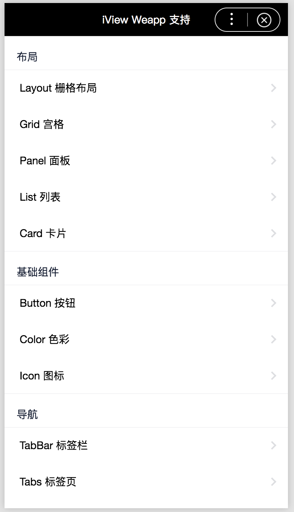

okam-iview-example

====

在 okam 的百度小程序中使用 iview 组件库

## 开发前阅读

此项目是基于 `okam` 开发框架开发的小程序项目，开发前先了解：[Okam 的使用](https://ecomfe.github.io/okam)

## ui 组件

- [iview](https://weapp.iviewui.com/docs/guide/start)

## pages 中的 示例来自 iview/example

[ivew example](https://github.com/TalkingData/iview-weapp/tree/master/examples)

## 效果


## 快速开始

### 准备工作

* 安装 Node (`Node >= 8` && `npm >= 3`)

* 执行 `npm install`

### 开发

* 百度小程序运行命令

    * `npm run dev`：           带 watch 开发模式

    * `npm run dev:clean`：     删掉构建产物（不包括项目配置文件）并重新构建且带 watch 开发模式

    * `npm run dev:server`：    带 watch && 开发 Server 开发模式

    * `npm run build`：         删掉构建重新构建（没有 watch && 开发 Server）

    * `npm run prod`：          生产环境构建

* 微信小程序运行命令

    * `npm run dev:wx：`        微信小程序开发构建

    * `npm run dev:wx:clean`：  微信小程序：删掉构建产物（不包括项目配置文件）并重新构建且带 watch 开发模式

    * `npm run dev:wx:server`： 带 watch && 开发 Server 开发模式

    * `npm run prod:wx`：       微信小程序生产环境构建

* 支付宝小程序运行命令

    * `npm run dev:ant`：       微信小程序开发构建

    * `npm run dev:ant:clean`： 微信小程序：删掉构建产物（不包括项目配置文件）并重新构建且带 watch 开发模式

    * `npm run dev:ant:server`：带 watch && 开发 Server 开发模式

    * `npm run prod:ant`：      微信小程序生产环境构建

* 头条小程序运行命令

    * `npm run dev:tt`：       微信小程序开发构建

    * `npm run dev:tt:clean`： 微信小程序：删掉构建产物（不包括项目配置文件）并重新构建且带 watch 开发模式

    * `npm run dev:tt:server`：带 watch && 开发 Server 开发模式

    * `npm run prod:tt`：      微信小程序生产环境构建

### 目录结构说明

```
.
├── README.md
├── package.json
├── doc                     // 缓存项目源图片或者其它文档目录
├── dist                    // 百度小程序 构建产物，开发工具得选择该构建产物目录作为项目根目录方能预览
├── wx_dist                 // 微信小程序 构建产物，开发工具得选择该构建产物目录作为项目根目录方能预览
├── ant_dist                // 支付宝小程序 构建产物，开发工具得选择该构建产物目录作为项目根目录方能预览
├── tt_dist                 // 头条小程序 构建产物，开发工具得选择该构建产物目录作为项目根目录方能预览
├── .tinyimgcache           // 图片压缩的缓存信息，不可删掉，否则会导致图片重复压缩
├── project.json5           // 小程序项目配置文件，除了语法使用 JS 对象形式，配置说明参考官方小程序说明
├── scripts                 // 构建相关脚本
│   ├── build.js            // 构建入口脚本
│   ├── base.config.js      // 基础构建配置文件
│   ├── base.config.js      // 基础构建配置文件
│   ├── tt.config.js        // 头条小程序构建配置文件
│   ├── ant.config.js       // 支付宝小程序构建配置文件
│   ├── wx.config.js        // 微信小程序构建配置文件
│   └── swan.config.js      // 百度 Swan 小程序构建配置文件
└── src                     // 项目源码
    ├── app.js            // 小程序入口脚本
    ├── app.styl         // 小程序入口样式
    └── pages               // 小程序页面集合
        ├── home            // 首页
        ├── ...
        └── ...
```

## 存在问题 （百度小程序中使用 iview 存在的问题）

- 引入了 `node_modules` 路径得组件 会导致出错，更换 路径名是 ok 的

    已解决： 将 `node_modules` 替换成 `npm`

- 用到的 `getRelationNodes` 即：behaviors、组件间关系、抽象节点 百度自定义组件不支持 等
- `relations` 不支持

- 自定义组件样式不生效 同名的组件 有的加前缀 有的不加前缀，导致组件样式渲染失败

    已解决：百度小程序已修复

- 字体渲染： 字体 ios 真机正常 、android 不正常

- event detail  微信与小程序不一致
已解决：框架已做兼容处理

- 里面用 `data` 上用了 `...` 了 必须 `babel7` 转

- `wxs` 语法不一致未做处理
<!-- 影响: wxs -->
    - [wx: wxs](https://developers.weixin.qq.com/miniprogram/dev/framework/view/wxs/)
    - [swan: filter](https://smartprogram.baidu.com/docs/develop/framework/view_filter/)

## 组件可用情况
* action-sheet [ok]
* alert [ok]
* avatar [ok]
* badge [ok]
* button [ok]
* card [ok]
* checkbox [getRelationNodes]
* collapse [icon]
* color [ok]
* count-down [ok]
* divider [wxs ==== ok, 1rpx 手动微调处理]
* drawer [ok]
* grid [getRelationNodes]
* icon [icon]
* index [wxs + 侧边标签不显示]
* input [样式] [height, min-height，混用渲染机制不一致]
* inputNumber [ok]
* layout [ok]
* list [开发工具]
* load-more [ok]
* message [ok]
* modal [getRelationNodes, 样式不一致]
* notice-bar [getRelationNodes icon]
* page [样式 + icon]
* panel [ok]
* progress [ok]
* radio [getRelationNodes]
* rate [开发工具]
* spin [样式 + 开发工具]
* steps [wxs + getRelationNodes]
* sticky [getRelationNodes]
* swipeout [wxs + icon === 开发工具]
* switch [开发工具]
* tab-bar [getRelationNodes]
* tabs [getRelationNodes]
* tag [wxs ==== ok]
* toast [ok]

### 代码规范说明
fecs: https://github.com/ecomfe/fecs

### 文档
* [iview](https://weapp.iviewui.com/docs/guide/start)
* [okam 使用教程](https://ecomfe.github.io/okam)
* [百度小程序](https://smartprogram.baidu.com/docs/develop/tutorial/codedir)
* [微信小程序](https://developers.weixin.qq.com/miniprogram/dev/index.html)
* [支付宝小程序](https://docs.alipay.com/mini/developer/getting-started)
* [头条小程序](https://microapp.bytedance.com/docs/framework/)
* [快应用](https://doc.quickapp.cn/)
